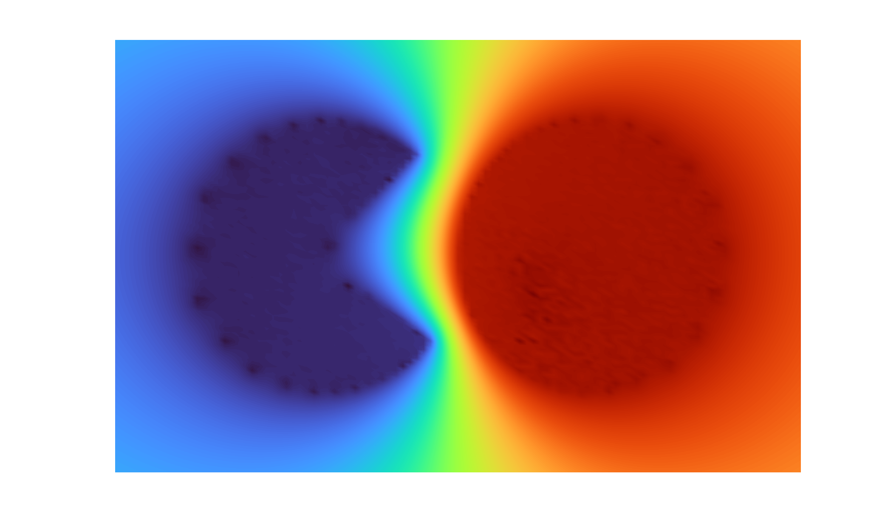
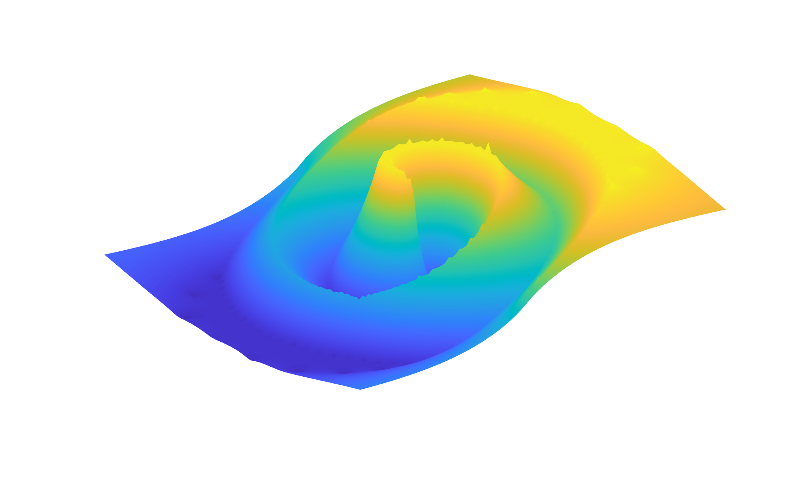
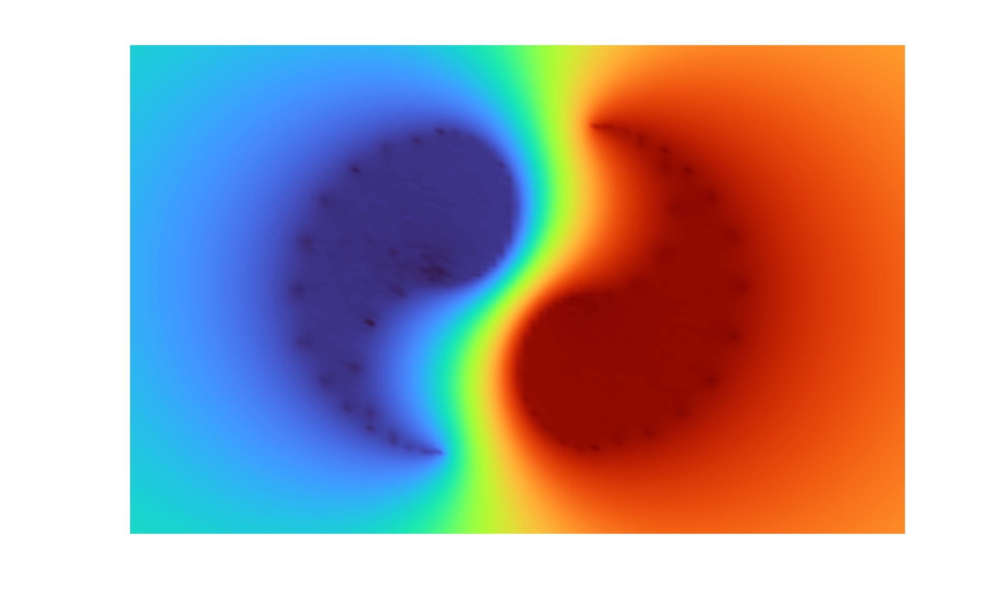
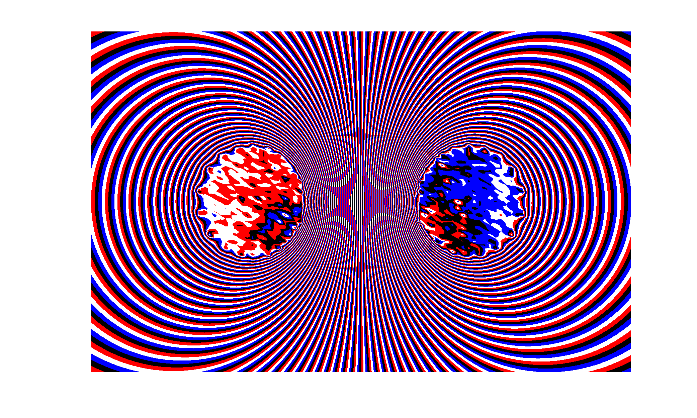

# Introduction

## Overview

This page accompany a the paper entitled "Rational approximation for Zolotarev sign and ratio problems", by C. Poussot-Vassal, I. V. Gosea and A. C. Antoulas [arXiv extended version](https://arxiv.org/abs/2511.04404). 
We study algorithms for Zolotarev (3rd and 4th) problems rational approximation. First, we show that the Loewner framework (LF) is appropriate to rapidly and with no iterations, approximate the Zolotarev problems by compressing the (numerous) interpolation conditions. Second, we compare the approximation properties (e.g. coefficients and poles) of LF with the standard AAA, AAA-sign and its AAA-Lawson variants. We concentrate the study on a canonical example, namely the symmetric two-circles one, for which the optimal solution is well documented. For this case, we highlight the numerical robustness of LF and its ability to recover the structure of the optimal solution. Additional non-trivial geometries are also reported, emphasizing that LF is fast, reliable, and yields accurate approximants with no user intervention.

This page provides the necessary numerical tools allowing to reproduce the results of the paper.

## Contribution claim

We summarize below the main contributions of this paper, which were confirmed through a series of comprehensive numerical experiments:
- we show that the LF solves Zolotarev problems by compressing the (many) number of interpolation points. This approach does not need neither any iterations nor user intervention, and yields solutions quite close to the optimal ones in a very low computational time. Consequently, the LF constitutes a valid alternative for addressing these problems;
- we show that, in some specific cases (notably the symmetric two circles one), LF recovers the structure of the optimal solution as well as its symmetry property (e.g., the distribution of eigenvalues and zeros, the alternance of polynomials coefficients, realness, etc.), whereas the other methods tend to add spurious and oddly distributed poles and zeros, and non trivial artifacts that can’t be easily explained. In addition, thanks to an extensive numerical experimentation, we demonstrate the numerical robustness in the results obtained with LF compared to AAA; 
- we conduct an extensive numerical study2 and comparison of the performance of different
methods3 w.r.t. to computing time, accuracy of fit and interpretability, for approximating
several sign functions defined on various domains showing, among others, the computational
advantage of LF.


## Main reference

```
@article{PVGA:2026,
	Author	= {C. Poussot-Vassal and I.V. Gosea and A.C. Antoulas},
	Doi 	= {},
	Journal = {submitted},
	Number 	= {},
	Pages 	= {},
	Title 	= {{Rational approximation for Zolotarev sign and ratio problems}},
	Volume 	= {},
  	Month   = {},
	Year 	= {},
	Note    = {\url{https://arxiv.org/abs/2511.04404}}, 
}
```

# The "zol" MATLAB package 

The code (`+zol` folder) provided in this GitHub page is given for open science purpose. Its principal objective is to accompany the readers, and thus aims at being as educative as possible rather than industry-oriented. Evolutions (numerical improvements) may come with time. Please, cite the reference above if used in your work and do not hesitate to contact us in case of bug of problem when using it. Below we present an example of use, then functions list are given.
It is also meant to allow reproduction of the results in the paper.


## Dependencies

- MATLAB R2023b or later (tested on this version)
- Toolboxes: "Control System Toolbox" and "Symbolic Math Toolbox" may be replaced but are preferable to run plug'n'play


## Simple MATLAB code examples

We provide a series of simple codes that describe how to deploy the LF and how to compare with some AAA approaches. These demo files are meant to reproduce some results contained in the above mentionned paper. More specifically, we include:
- `demo1_LF.m`: runs the LF to solve Z3 and Z4 problems. This stript is a good starting point to appreciate LF for Z3 and Z4.
- `demo2_LF_vs_AAA.m`: compares the rational approximations obtained by the LF and the AAA, for the Z3 and Z4 problems. Here, attention is given to the accuracy, and obtained poles and zeros for a given topology. 
- `demo2_LF_vs_AAA_time.m`: compares the rational approximations obtained by the LF and the AAA, for the Z3 and Z4 problems. Here, attention is given to the ratio number and computational time for each methods, over all topologies. 
- `demo3_art.m`: plots fancy Z3 figures (see some examples at the end of this page).
- `demo3_LNT.m`: for multiple topology, compares LF and AAA accuracy and computational time.


## MATLAB code for analyzing the numerical robustness on case '1a' (two symmetric circles)

During our numerical experimentations, we also put attention on the canonical "two symmetric circles" case. This case is well known in the litterature and the optimal solution is analytically known. Sequentially running the three steps code below allows to compare LF with different shade of AAA (with different options) and report on the results accuracy and robustness wrt. the machine used. More specifically 
- `report_1a_step1.m`: computes the approximation with different configurations
	- lines 5 and 7, add the path for this package and the AAA code
	- line 9, `nameUsr = 'YOUR-NAME';`, put your name or accronym
	- run the code
	- it will create a folder in `tex_pdf\data\YOUR-NAME_YOUR-MACHINE-NAME`
	- if possible, can you send me a ZIP file of `YOUR-NAME_YOUR-MACHINE-NAME`
- `report_1a_step2.m`: computes the LaTeX tables and figures for each approximation
	- line 9, `fileDir = 'YOUR-NAME_YOUR-MACHINE-NAME';`, put the name of the folder created in `report_1a_step1.m`
	- run the code
	- it will create the folders in `tex_pdf\data\YOUR-NAME_YOUR-MACHINE-NAME\figures` and `tex_pdf\data\YOUR-NAME_YOUR-MACHINE-NAME\tables` 
- `report_1a_step3.m`: exvaluate the numerator and denominator monomial dispersion
	- line 9, `fileDir = {... 'YOUR-NAME_YOUR-MACHINE-NAME'};`, add the name of the folder created in `report_1a_step1.m` to the list of already existing folders
	- run the code
	- it will create the figures in `tex_pdf/figures/1a/`
- Go in `tex_pdf` and open `appendix_1a.tex`:
	- after line 12: add `\input{data/YOUR-NAME_YOUR-MACHINE-NAME/tables/1a_nd_r\n}`
	- after line 31: add `\input{data/YOUR-NAME_YOUR-MACHINE-NAME/tables/1a_pol_r\n}`
	- after line 43: add `\input{data/YOUR-NAME_YOUR-MACHINE-NAME/tables/1a_zer_r\n}`
- Go in `tex_pdf` and open `main_1a.tex` and compile it, now you have the implementation robustness report!


## Functions description

Please check help in the functions below, where all informations and details are provided: 
```Matlab
help zol.example
help zol.example2data
help zol.loewner
help zol.pb4_to_pb3
```

## Feedbacks

Please send any comment to C. Poussot-Vassal (charles.poussot-vassal@onera.fr) if you want to report any bug or user experience issues.


## Disclaimer

This deposit consitutes a research code that accompany the paper mentionned above. It is not aimed to be included in any third party software without the consent of the authors. Authors decline responsabilities in case of problem when applying the code.

Notice also that pathological cases may appear. A more advanced and professional code, to deal with practical and theoretical issues/limitations is currently under development by the authors.


# Zolot'art


*Z3 for Pac Man.*


*Z3 for spiral.*


*Z3 for Ying and Yang.*


*Z3 two circles.*


